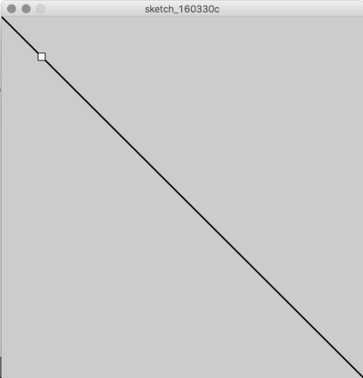

# Simulación de IPC

## Proyecto para simulación de IPC

Este es un proyecto base para visualizar problemas clásicos de concurrencia
con la herramienta [Processing](http://processing.org) utilizando el
modo [Python](http://py.processing.org).


## ¿Qué es Processing?

Processing es un entorno para programación visual utilizando el lenguaje Java.
Processing utiliza una estructura similar a un sketch de Arduino:

```java

void setup() {
    size(500, 500); // Crea una ventana de 500 x 500 pixeles
}

void draw() {
    fill(255, 255, 255); // Color de relleno blanco
    line(0, 0, 500,500); // Dibuja una línea desde la esquina superior izquierda hacia la esquina inferior derecha.
    rect(50, 50, 10, 10); // Dibuja un rectángulo de 10 x 10 pixeles, en la posicion (50, 50) de la pantalla
}
```

Resultado:



# ¿Para que sirve el modo Python?

El modo Python simplifica el trabajo con Processing ya que no se requiere definir tipos de variables y aporta una tipo de datos llamado diccionario o
`dict` que es conveniente para tener asociaciones `pid: mensaje`.
Por otro lado existe una biblioteca, [incluida en el proyecto](./cstruct.py), que permite tomar los datos enviados desde C de manera directa desde la
estructura TMensaje (definida en [c/comm.h](c/comm.h)).

```c
typedef struct {
    char prog_name[20];
    int pid;
    int id;
    int estado;
    /* Información extra */
    char msg[80];
    int x;
    int y;
} TMensaje;

```

## ¿Cómo se instala el modo Python en Processing?

TODO

## Programas a simular

Los programas a simular deben estar en la carpeta `c`.

Estos programas deben hacer uso de `comm.h` y `comm.c` para enviar
mensajes a la simulación.

